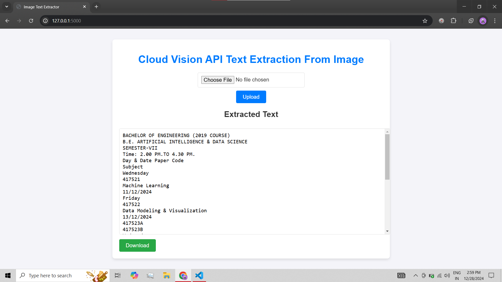

---

# **Computer Vision Text Extract 📸📝**

## Overview 🌟
**Computer Vision Text Extract** is a powerful web app that allows you to extract text from images using the Google Vision API. Once extracted, the text is cleaned, formatted, and saved as a `.txt` file on the server. You can then download the file with just one click! 💾✨

## Key Features 🚀
- **Upload Image**: Simply upload an image containing text 📷.
- **Text Extraction**: The app uses the Google Vision API to extract text from the image 🧠💡.
- **Text Formatting**: Extracted text is cleaned and formatted for easy reading ✨📄.
- **Download**: After extraction, download the formatted text as a `.txt` file 📥.

## Technologies 🛠️
- **Flask**: A lightweight Python web framework that powers the app 💻.
- **Google Vision API**: Powers the text extraction from images 🧑‍💻🤖.
- **HTML/CSS**: Simple and responsive frontend for a seamless experience 🌐.
- **Python**: Backend scripting language that handles text extraction and formatting 🐍.

## How It Works 🔄

1. **Upload an Image** 📸  
   You start by uploading an image containing text (e.g., invoices, receipts, or notes).

2. **Text Extraction** 🧠  
   The app uses the **Google Vision API** to detect and extract the text from the image.

3. **Text Formatting** ✨  
   Once extracted, the text is cleaned and formatted for better readability.

4. **Download Your Text** 📥  
   After the text is processed, a **Download** button will appear, allowing you to save the formatted text to your device as a `.txt` file.

## UI Screenshot 🖼️

Here’s a screenshot of the app’s user interface showing how the extracted text is displayed along with the **Download** button once the process is complete:

---
